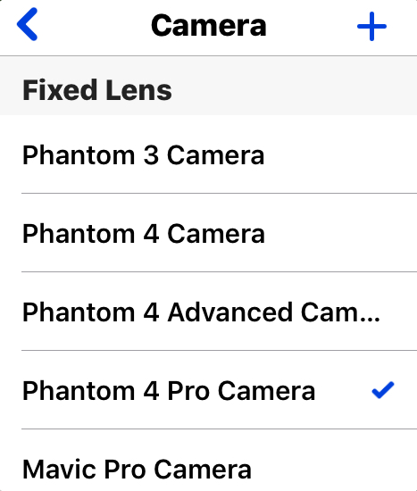
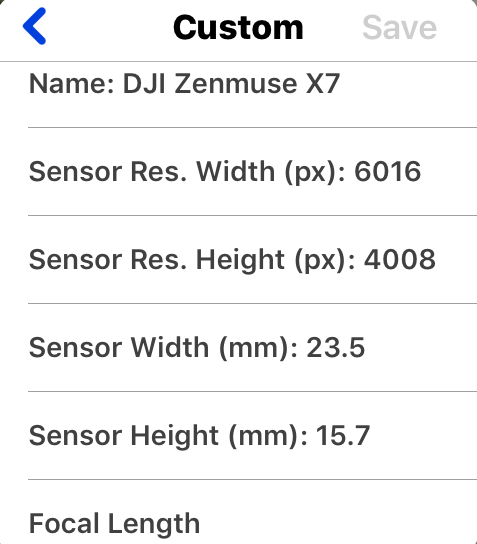
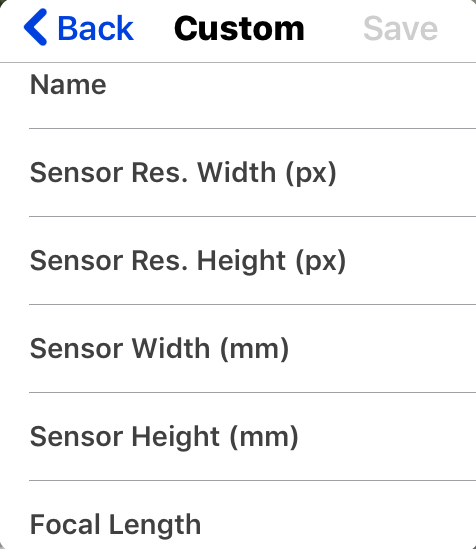
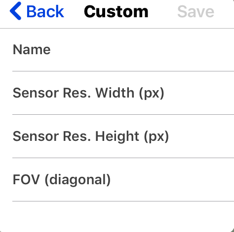
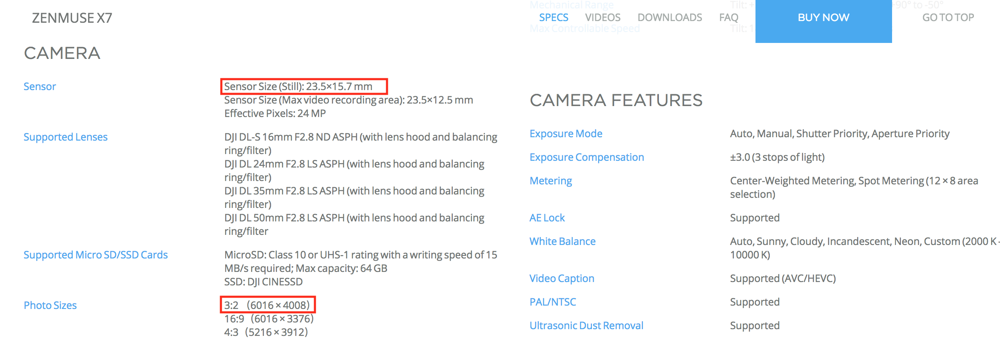

# Camera Settings (for iOS)

## Cameras with fix lens

All cameras with fix lens are listed under the "Fixed Lens" section. Users can directly choose their cameras according to the camera models. Here the cell with check mark means choosed.

## Cameras with changeable lens

Since the camera on DJI Zenmuse series can change lens, users can input different lens information according to the camera model type.

1. Choose the camera model type
2. Input camera name and focal length while other values are optional and provided default values
3. Click "Save"

## Custom Cameras
Users can custom their own camera.

1. Click "+" on the right upper corner
2. Choose the cell according to your camera information e.g. "Known Focal Length" or "Known FOV"
3. Fill the information

	

	

4. Click "Save"

PS：All the camera information such as sensor resolution and sensor size can be founded on the official website of the camera productors. For example Zenmuse X7 camera:

---

Last modified at {{ file.mtime }}