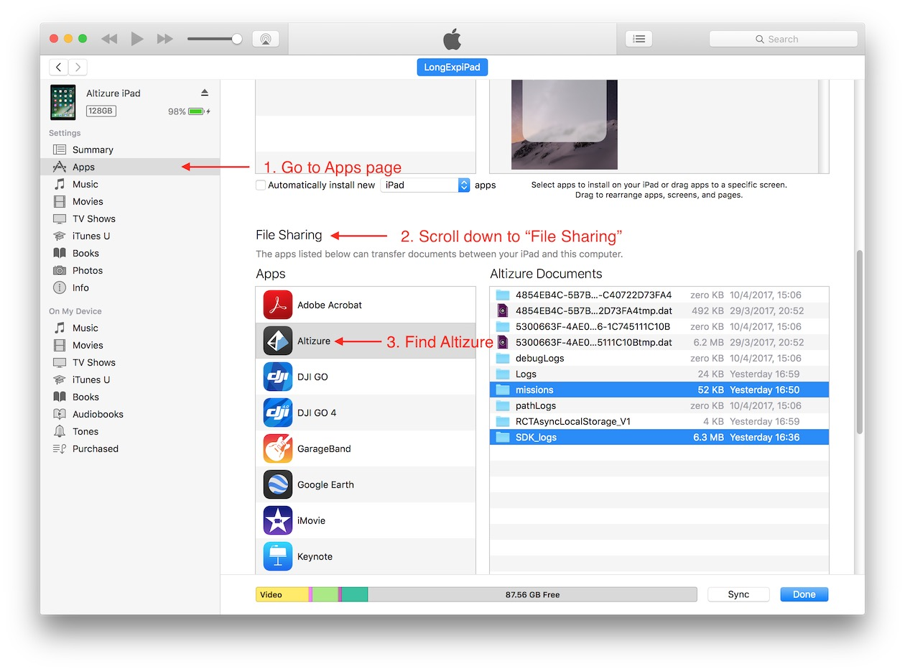

# Flight Safety

## When my aircraft runs out of battery, can it automatically return-to-home (RTH)?

You can let your aircraft return home by pressing the RTH button on it remote controller, or the “Return Home” button in Altizure app.

If Altizure app is successfully connected to the drone, normally, it can monitor the battery level and send you an alert popup when the battery is lower than 30%. You can decide whether the drone needs to Return Home by clicking the buttons on the popup.

If the battery is lower than 20%, Altizure app will automatically force the drone to return to its take-off location.

However, please note that for the RTH action, it will not work if the aircraft is disconnected from its remote controller. For more information on Signal Loss, please refer to our next section.

## When the drone loses its signal, will it continue its mission or return to home (RTH)?

Your aircraft will automatically cancel the flight mission if it loses connection for several seconds. Then it will perform Remote-Controller-Signal-Lost action, which is set to RTH by default. You can cancel RTH by pressing the RTH button on your remote controller after your aircraft is connected again. The drone will then hover in the sky and wait for your next command. For more details on RTH, please read the DJI guidelines carefully.

As said above, RTH is the default setting of Remote-Controller-Signal-Lost action. But it can be set to other values, e.g. land on the ground or hover in the sky after the signal is lost. To change this option, please go to the "Advanced Settings" section in DJI Go.

Besides, for the "On Signal Loss" option in Altizure app, you can also set it as “Continue Mission”. In that case, your aircraft will not cancel the flight even when it loses signal from remote controller.

However, this is a dangerous move because you may lose track of your drone if:

1) "Continue Mission on Signal Loss" option is activated.

2) The drone has been disconnected for a long time.

3) Battery runs below the “Critically Low Battery Warning" level before the mission is completed (please find the "Critically Low Battery Warning” threshold in DJI Go).

The above situations are dangerous because:

* DJI firmware force aircraft to land if battery is below the "Critically Low Battery Warning" level. 
* If a mission is neither completed nor canceled, DJI firmware will not activate RTH when the battery gets low. 
* The aircraft cannot receive RTH signal from app or remote controller when it is disconnected.

## How can I export flight log/ flight record?

DJI Mobile SDK will record flight log when the user is using Altizure app. The flight log is useful for investigating accidents that occured when using Altizure app. 

### Export from Android App

In Android, log files are stored in directory /DJI/SDK_logs, you can export it by using any file explorer.

### Export from iOS App

Here are the steps to export the flight log:

1. For Windows users, please [download and install iTunes](https://www.apple.com/itunes/download/) on your computer. Connect your iPhone/iPad to your computer. (For macOS users, iTunes is its default application.)

2. Open iTunes and click the device icon
  
3. Go to **apps** page, and scroll down to **File Sharing** section. Click **Altizure** app
  
4. Select **SDK_logs**, and scroll down to click **Save to...** button (or drag it to your desktop)
  

---

Last modified at {{ file.mtime }}
