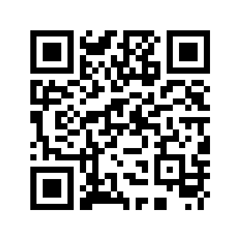

# Introduction

## Download Links{#installation}

For more details, please check [Altizure Official Website](https://www.altizure.com/mobile):

* iOS: Search "Altizure" in AppStore. Download and install. [Click here to download Altizure App from App Store](https://itunes.apple.com/app/id1018791616?mt=8). Or, your can download it by scanning the QR code. (You are recommended to use the smart phone camera in iOS 11):
  
        
* Android: You can download it from Android App Store (e.g. Google Play) by searching "Altizure".

## Main Functions{#features}

### Flight Planning

* Automatic flight planning: Altizure app automatically creates five flight paths with the first one covering the vertical views and the other four the oblique views.
* Automatic adjustments in Camera Angles and automatic image-taking function.
* Save and upload mission function.
* Continued flights requiring more than one battery swap can resume correctly as Altizure app records flight status automatically.
* Adjustable settings in overlap, tilt angle, etc.
* Possibility to choose between Return-to-Home and Continue-the-Mission in Signal Lost.
* Function on automatically adjusting the flight routes according to the camera you choose.
* Support for Apple Map. (iOS) and Gaode Map (Android)
* Support for Google Map. (You should be able to connect to Google.)
* Support for Coordinate Calibration. (for Mainland China users)
* Support for flight record export.

Other Functions (only available for iOS):
* Support importing and displaying additional KML layers.
* Support partitioning a large scale mission into multiple small scale missions.
* Support adding an annotation to a point on the map by entering its GPS coordinates.
* Support adding Tile layers both online and offline.
* Suport customized camera settings.
* Allow adjusting settings in Flight Speed and the time between shots in the interval shot mode.
* Allow adjusting exposure settings in Altizure app.
* Support No-Fly-Zones display on map.
* Has integrated flight simulator.

## Supported Smart Phones/ Tables & UAVs{#devices}

### Requirements on Smart Phone/ Tablet

* iOS: Must be iPhone, iPad or iPod with iOS 9.0 or above.
* Android: Must be smart phones/ tablets with Android 6.0 or above. (Do not support devices with Intel CPUs)

Note: Do not support DJI aricrafts with Display Controllers, e.g. Phantom 4 Pro+.

### Supported UAVs

| UAVs | iOS (v4.0.0) | Android (v3.7.3) |
| ---  | :---: | :---: |
| Phantom 3 \(Pro / Advanced / 4K / Standard\) | ✔︎ | ✔︎ |
| Phantom 4 \(4 / 4 Adv / 4 Pro\) | ✔︎ | ✔︎ |
| Mavic Pro | ✔︎ | ✔︎ |
| Inspire 1 / 2 | ✔︎ | ✔︎ |
| M100, M600 series 1 | ✔︎ | ✔︎ |
| A2 / A3 + LB2 1 | ✔︎ | ✔︎ |
| M200 series 1 | Testing | Testing  |
| N3 + LB2 1 | Testing  | Testing  |
| Spark 2 | Not Supported Yet | Not Supported Yet |
| Mavic Air 3 | Not Supported Yet | Not Supported Yet |
| Phantom 3 SE 4 | Not Supported | Not Supported |
| Phantom 4 Pro+ (Includes Display) 5| Not Supported | Not Supported |

Notes:

1. As there's no API for third-party cameras at the moment, Altizure App only supports DJI cameras. If you use Altizure app with a third-party camera, your drone may not be able to automatically take photos.
2. Spark does not support waypoint mission, which is required by Altizure app. The reason for this is unknown.
3. As this is a new model, DJI SDK cannot support this UAV at the moment. We need to wait for DJI's SDK updates and the updates in waypoint mission support.
4. DJI SDK is not (and probably will never be) fully compatible with Phantom 3 SE.
5. Altizure app does not support aircrafts with Display Controllers. It must be used on a remote controller without a Display Controller.

### Supported Cameras for Waypoint Missions{#cameras}

| Cameras | iOS (v4.0.0) | Android (v3.7.3) |
| ---  | :---: | :---: |
| Cameras carried by aircrafts of Phantom、Mavic、Spark series | ✔︎ | ✔︎ |
| Zenmuse X3, X4S, X5/X5R/X5S | ✔ ︎|✔︎ |
| Other cameras | Support adding additional camera components 1 | ✖︎ |
Note:
1. You can add camera parameters for flight planning and automatic flight. As there's no API for third-party cameras at the moment, Altizure app cannot take photos automatically if you use a third-party camera.

---

Last modified at {{ file.mtime }}