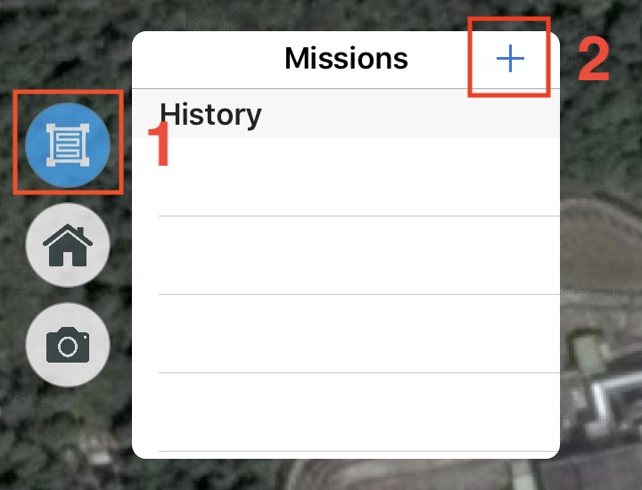

# Flight Missions (iOS version)

## Create a New Mission {#create}

1. Click the **Mission** icon on the left side of your screen and open the **Mission** panel. 点
2. Click **"+"** icon, and create a new mission at the center of your screen. You can change the mission settings on **Mission** panel.
 图标，在地图中心创建新任务，同时任务面板上会显示一些设置项

    

## Save/ Load Missions {#save-load}

任务设置完成后，点击任务面板右上角的“保存”，便会弹出窗口。输入名称后，任务便会被保存在 app 内。

打开任务列表，可以根据名称找到之前保存的任务。点击“加载”即可读取该任务。

## Unlock/ Edit Missions {#unlock}

任务保存后，或刚加载出来时，任务设置处于锁定状态，防止误操作导致任务区域和各项参数被修改。

需要调整这些设置时，点击设置面板顶部的“编辑/锁定”，切换成“编辑”模式。执行任务前，需要再次点击保存按钮，进入“锁定”模式才能进行后续操作。

## Mission Files {#files}

任务文件被保存在平板设备的 missions 文件夹内，里面每个子文件夹 missionXXX （XXX 为序号）都表示一个任务。使用电脑上的 iTunes 等工具可以备份任务设置，或者用来迁移、分享任务给其他设备使用。

---

Last modified at {{ file.mtime }}
