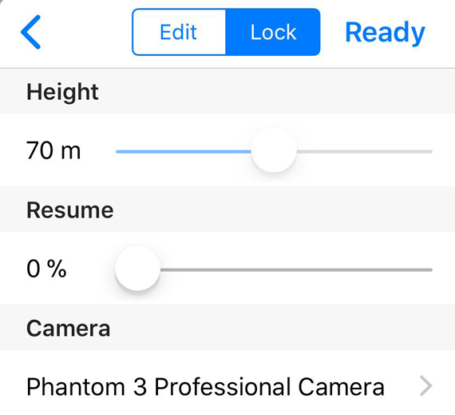

# Mission Settings (for iOS)

## Flight Area & Flight Paths {#region}

In Altizure app, the green rectangle represents the area that will be captured and built into a 3D model. The gray semi-transparent polygon indicates the region that the aircraft will possibly fly over in the 5 flight missions automatically set by the app. When setting the flight area, users should set the area as possibly as they can in an region where there's no high-rise buildings or mountains, as well as No-Fly Zones. 

地图上绿色矩形为建模区域，灰白半透明多边形为飞机可能的飞行区域。**使用者应尽可能地让飞行区域避开附近的建筑和高山**，以及规定的禁飞区域。

The white polyline on the map represents a flight route/ path with a white arrow at each end, indicating the start point and the end point of the route.

地图上白色折线为飞机航线，两端各有一个白色箭头，表示航线的起点和终点。

## Basic Settings {#basic}

**Mission Settings** panel:

### Flight Altitude {#altitude}

If we regard the altitude of the takeoff point as 0, you can set the Flight Altitude between 10m and 500m. For safety reasons, users should make sure that the flight altitude is higher than the obstacles within or around the flight area.

以起飞点为 0 的相对高度，可以设置为 10 米到 500 米之间。安全起见，使用者应当确保飞行高度高过周边所有障碍物。

Please notice: The maximum flight altitude is restricted to the **Maximum Flight Altitude** set in DJI Go. So, before setting the flight altitude, you can check or revise relevant settings in DJI Go.

注意：最大飞行高度也受到 DJI Go 里 “最大飞行高度” 的限制，因此在设置高度前，应当前往 DJI Go 里查看并修改飞机的高度限制。

### Camera {#camera}

不同型号的相机具有不同的视角范围，为保证拍摄质量和拍摄效率，使用者应当选择相应的相机型号。

注意：某些相机可以使用不同的镜头，例如 Zenmuse X5S。选择列表里只列出了默认/常见的镜头焦距。如果使用的是不同焦距的镜头，请添加自定义相机并填入相关的参数。

### Skip the Already-Finished Parts {#resume}

这个选项可以用于更改航线的起点。

在执行一些较大型任务时，常常出现一块电池飞不完，或者在中途因为异常原因中断的情况。在这种情况下，使用者可以通过调整 “跳过已完成部分” 来避免重复拍摄已经完成的部分航线。

如何使用：注意观察航线上白色箭头的位置，然后调整这个选项。可以发现，进度条滑动时，表示航线起点的白色箭头会沿着航线前行方向跳动，略过的部分也会变得黯淡虚化。在下一次执行任务时，飞机就会前往调整后的起点，不再执行略过部分。

在飞机执行任务期间，软件会随着任务的进行自动调整这个数值，同时地图上白色箭头也会随之跳动，这就表示软件已经将任务进度保存下来，以便下次继续执行。

## 高级设置 {#advanced}

### 信号丢失时行为 {#signal-loss}

有时飞机执行任务的过程中会出现信号中断的情况，这个选项就是用于设置飞机在中断信号后的行为。为了满足各类使用者的需要，我们提供了两种选项：

* 信号丢失后中止任务（默认）
* 信号丢失后继续任务（危险操作，不推荐）

如果使用者没有特殊的需求，应当将这个设置保持为默认选项，即“终止任务”。需要启用这个选项的任务请务必详细阅读这个选项下方的警告，以及我们在教程 [飞行安全](../faqs/safety.md) 里关于信号丢失或电量低时的说明。

### 航向重叠率、旁向重叠率 {#overlap}

航向重叠率表示飞机在沿航线飞行时，拍摄的连续两张照片之间的重叠比例。旁向重叠率表示飞机在两条相邻平行航线上拍摄的照片的重叠比例。

---

该文档最后修改于 {{ file.mtime }}
