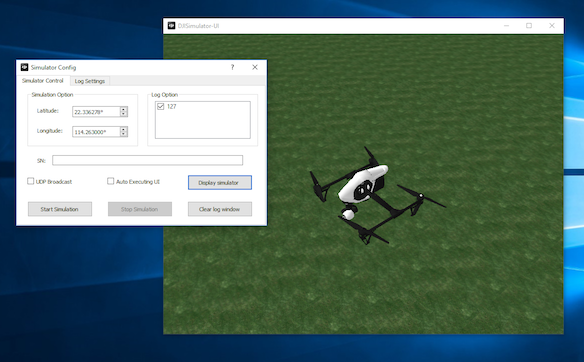
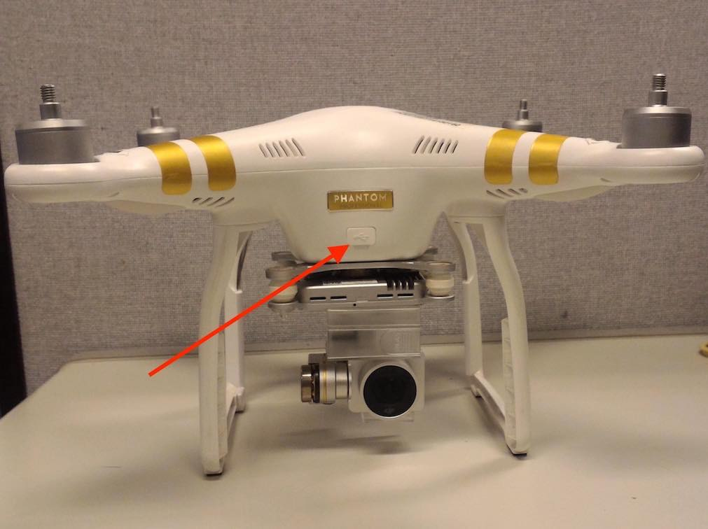
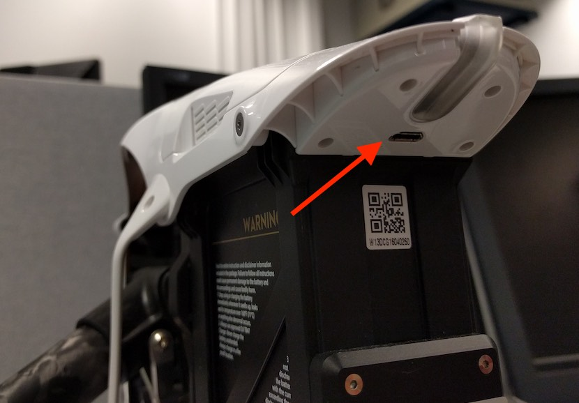
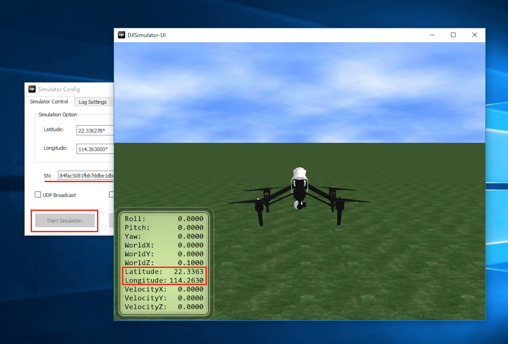

# Learn how to use Altizure App in DJI Simulator? (Phantom 3, Inspire 1, M100, etc.)

## Supported UAVs

* Phantom 3 \(Pro / Adv / 4K / Standard\)
* Inspire 1, Inspire 1 Pro, Inspire 1 Raw
* Matrice 100

## Supported Platforms

* Windows

## A Step-by-Step Guide

### 1. Download and install DJI Simulator

Download and install [DJI PC Simulator](https://drive.google.com/file/d/0B12rCazzaH98SFhVRVRBTFlZWlU/view) and [Windows Driver](https://drive.google.com/file/d/0B12rCazzaH98dTc5NGplZk1oSEk/view). (Please note that they are official DJI Simulator installers, but DJI has removed those download links from their website)

Open **DJI PC Simulator** and click **Display Simulator**.

### 2. Connect your aircraft to computer

Open your aircraft with propellers detached. Use a USB cable to connect your aircraft and computer.

### 3. Open the DJI Simulator on Windows

Enter the Latitude and Longitude near you. This will be the simulated location of your aircraft. Then, click **Start Simulation**. Once connected, the button should be greyed out, latitude and longitude are shown in simulator.

In simulator, you can control your aircraft with your remote controller, DJI Go, Altizure and any other third-party DJI app, This will help you learn how to use these apps without any risks.

输入你所在位置的 **Latitude**（纬度）和 **Longitude**（经度），点击 **Start Simulation **启动模拟器。 如果启动成功， 这个按钮会变成灰色，模拟器里也会显示当前的经纬度。

### 4. 试用 Altizure

连接手机和遥控，打开 Altizure。在 app 里找到无人机的位置（启动模拟器前输入的经纬度），在附近规划并开始一个新的航点任务。

### 其他技巧

* 这里有 [DJI 官方教程](https://developer.dji.com/mobile-sdk/documentation/application-development-workflow/workflow-testing.html#aircraft-simulator) 介绍如何使用模拟器。
* 模拟器模式下也同样会拍摄照片，请在模拟结束后删除这些照片来释放 SD 卡的储存空间。
* 用鼠标可以拖动模拟器界面变更视角，用鼠标滚轮可以拉近或拉远。
* 右键点击模拟器界面, 点击 **setup**, 选中 **show trace**, 可以显示已飞过的航线。
    

---

Last modified at {{ file.mtime }}
