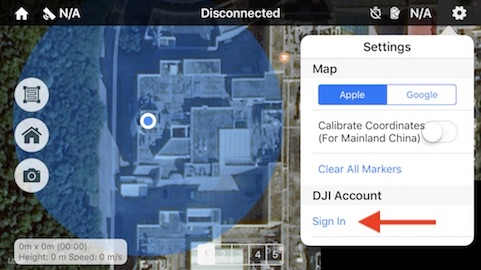
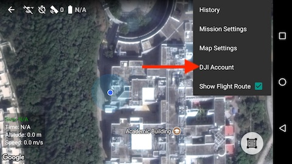

# Using Altizure (for First Time Users)

## Activate Your App by Connecting to the Internet{#activate}

For Altizure app first time users, before Altizure app is connected to the drone, DJI will check Altizure's API key and activate Altizure app on your device. So, please make sure that your phone is connected to the Internet. If the activation fails, there will be a popup on the interface, indicating that the activation failed. But if there's no popup, it means the activation is successful.

When using Phantom 3 Standard or Phantom 3 4K, please DO NOT connect to the drone's Wi-Fi if you are using Altizure app for the first time. This is because the drone's Wi-Fi is not connected to the Internet, and the activation may fail.

After a successful activation, you can use our app offline in the future.
 
## Login You DJI Account{#signin}

Due to the restrictions set by Chinese government and DJI, you MUST login your DJI's account in Altizure app to unlock the drone. This is required for all third-party flight-planning apps in Mainland China. Or otherwise, the drone-operating functions will be severely restricted by the firmware, and your drone can only fly within a small range of area. Image transmission function will also be disabled.

Entrance:

* iOS version

    

* Android version

    

---

Last modified at {{ file.mtime }}