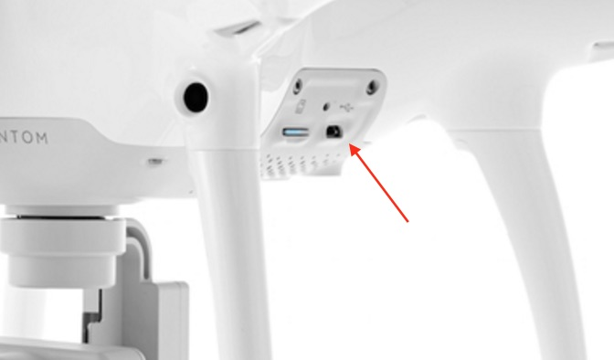
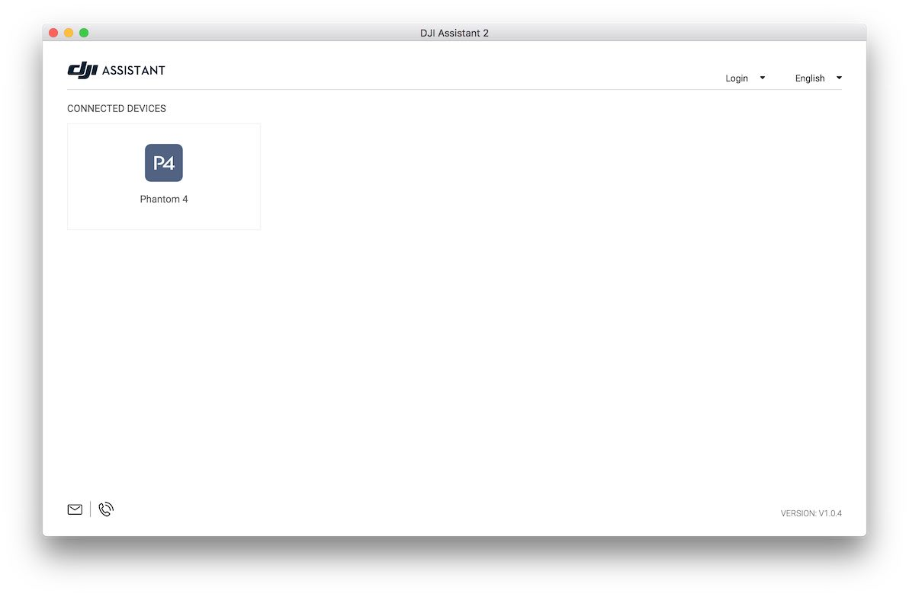
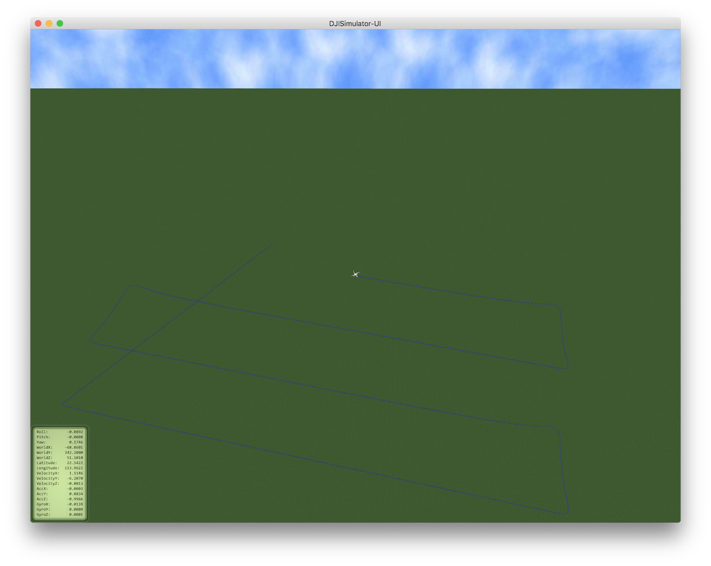

# Learn how to use Altizure App in DJI Simulator? (Mavic, P4, Inspire 2, M600, etc.)

## Supported UAVs

* Spark
* Mavic Pro
* Phantom 4 \(4 / 4 Advanced / 4 Pro\)
* Inspire 2
* M600, M200, M210, etc.
* A3, N3, etc.

## Supported Platforms

* Windows
* macOS

### 1. Download and run DJI Assistant 2

Please go to DJI's product page. In the **SOFTWARE** section, download and install DJI Assistant 2 on your computer.

* [Download for Phantom 4](http://www.dji.com/phantom-4/info#downloads)
* [Download for Phantom 4 Pro](http://www.dji.com/phantom-4-pro/info#downloads)
* [Download for Inspire 2](http://www.dji.com/inspire-2/info#downloads)
* [Download for M600](http://www.dji.com/matrice600/info#downloads)
* [Download for Mavic Pro](http://www.dji.com/mavic/info#downloads)
* [Download for Inspire 2](http://www.dji.com/inspire-2/info#downloads)

### 2. Connect your aircraft to computer

Open DJI Assistant 2. Then, open your aircraft with propellers detached. Use a USB cable to connect your aircraft and computer.

Below is the screenshot of DJI Assistant 2 when Phantom 4 is connected:

### 3. Start simulator

Click **Simulator** in left panel. Enter the Latitude and Longitude near you. This will be the simulated location of your aircraft. Then, click **Start Simulating**.

### 4. Try Altizure App

Connect your remote controller with Altizure app. In Altizure app, find the simulated location of your aircraft on the map in Altizure app, and start a new mission.

## Tips

* Here is a [DJI Guide](https://developer.dji.com/mobile-sdk/documentation/application-development-workflow/workflow-testing.html#aircraft-simulator)on using the simulator.
* Under the simulation mode, your aircraft will still take photos. So, after simulation, you may need to delete these photos to free up space in SD card.
* Scroll your mouse wheels to zoom in/out in simulator.
* Right click the simulator, select **Setup**, tick **Show Trace**, then you can see the flight path.

    

---

Last modified at {{ file.mtime }}
