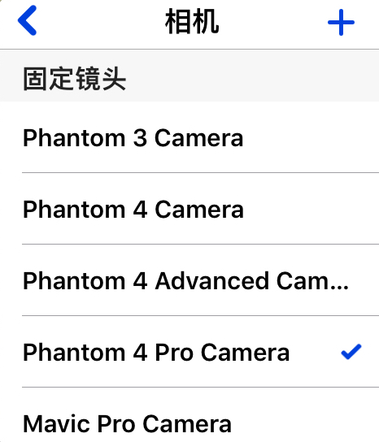
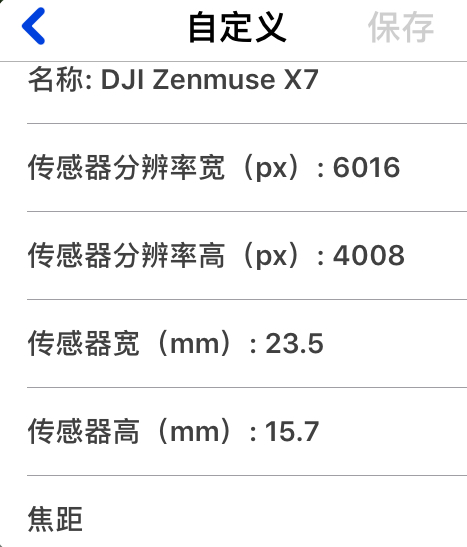
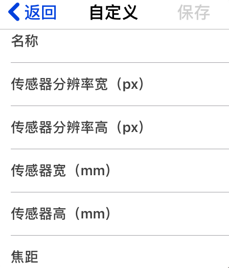
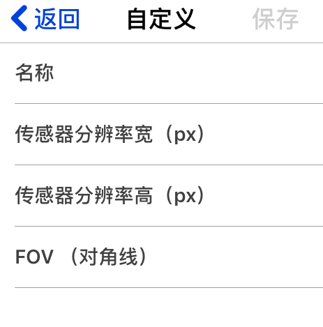
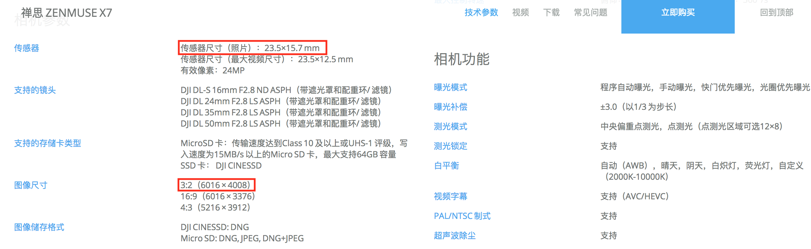

# 相机选择 (iOS 版)

## 固定镜头相机

相机列表下的"固定镜头"标题下列出了所有配备固定镜头的相机型号。用户可直接选择对应的相机型号，此处打勾即为已选相机。

## 可更换镜头相机
由于 DJI 禅思（Zenmuse）系列的相机可更换镜头，所以用户可在对应型号的相机列表处选择输入自定义镜头信息。

1. 选择对应的相机型号
2. 输入名称和焦距，其他值已提供默认值可选填
3. 点击“保存”

## 自定义相机
用户还可以完全自定义相机。

1. 点击右上角“＋”图标
2. 根据已知信息选择对应栏目 如：“已知焦距”或“已知FOV”
3. 填入对应信息

	

	

4. 点击“保存”

注：所有相机信息如传感器分辨率，传感器尺寸均可在相机厂家官网查询，例如 Zenmuse X7相机：

---

该文档最后修改于 {{ file.mtime }}