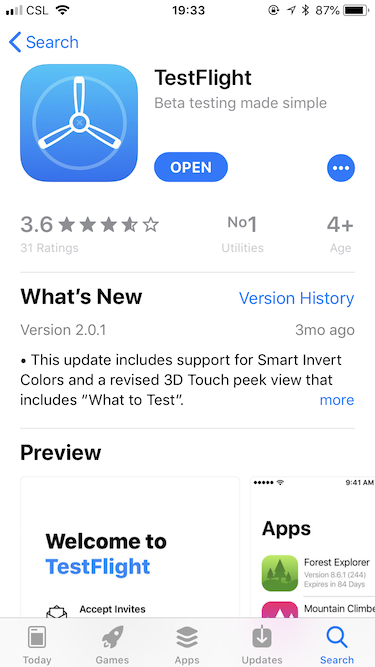
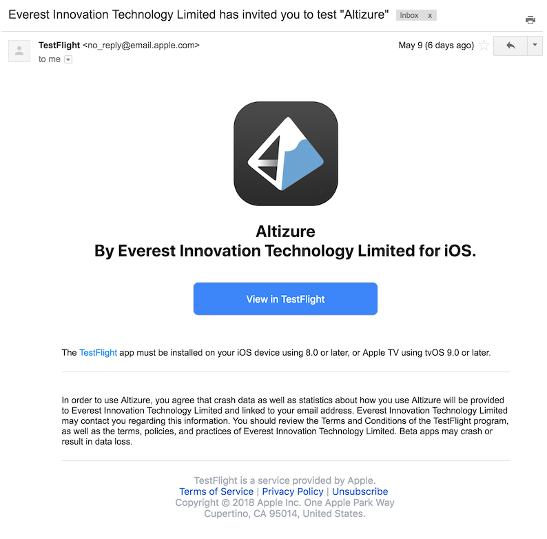
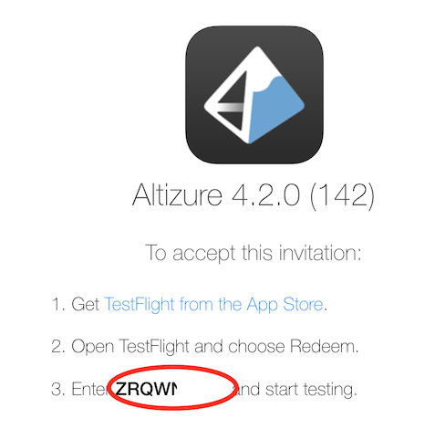
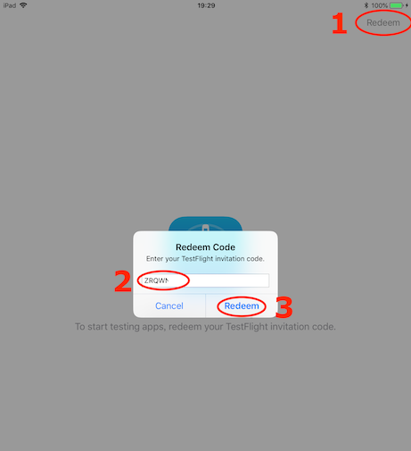
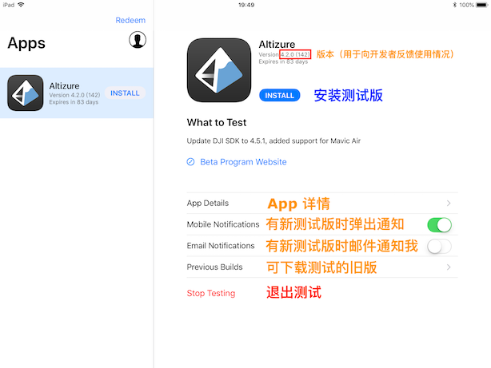

# 加入 Altizure iOS 版测试通道

## 关于测试通道

由于苹果商店的限制，一旦安装新版 app，就无法退回旧版使用。为了防止一些特殊机型和旧固件版本受到新版 DJI SDK 的影响，我们通过苹果官方推荐的 TestFlight 为 Altizure iOS 版开放了测试计划。加入测试版后，您可以随时卸载测试版，安装回稳定版本。

欢迎各位加入测试，提前预览新版功能，在开发过程中给我们建议，帮助我们改进 Altizure app，加速新功能的发布。

## 加入方法

1. 向我们申请参与测试（例如发送邮件至 support@altizure.com，或者填写 [在线申请表](https://forms.office.com/Pages/ResponsePage.aspx?id=UkEdbNA5ykSI2bjW3coHCHQv4PpKa6ZHuCWabi7gAvJUOUZZM0JDVlVQUlM0SFZORUdIOFdJNDFPNS4u)）。

2. 在苹果官方应用商店 AppStore 中通过搜索 TestFlight 或扫描下面的二维码，下载苹果官方出品的 [TestFlight app](https://itunes.apple.com/cn/app/testflight/id899247664)。

      

3. 我们收到并向您发送测试邀请后，您的邮箱里将会收到苹果官方发来的邀请邮件。(没收到的请留意邮箱的垃圾邮件)

    

4. 点击邮件里中央蓝色的 **View in TestFlight** 按钮。

    

5. 如果您是在电脑或其它设备上打开邮件，会看到苹果的说明，请注意第三行里 **加粗的邀请码**。(注：如果您是在已经装有 TestFlight 软件的 iOS 设备上点击邮件里的 **View in TestFlight** 按钮，系统会自动跳转至 TestFlight 软件里加入测试。)

    

6. 在手机或平板上打开 TestFlight app，点击 **Redeem** 按钮，输入上一步获得的邀请码即可加入。

    

7. 在 TestFlight 中点击 **INSTALL** 安装测试版本，安装后图标左下方会有个圆点。您可以随时卸载测试版，然后在 AppStore 里安装旧版。

    

## 温馨提示

测试版也是经过开发人员一定时间的内部测试之后发布的，可以用于正常飞行。如果您不放心新版的稳定性，可以使用 DJI 官方的 PC 模拟器试验飞行。

模拟器使用方法：

* [在模拟器中测试 Altizure (旧机型 P3, Inspire 1, M100 等)](../simulator/pc-simulator1.md)
* [在模拟器中测试 Altizure (新机型 Mavic, P4, M600 等)](../simulator/pc-simulator2.md)

## 问题反馈、建议和讨论

欢迎在本贴回复讨论测试版的内容，或者通过邮件 support@altizure.com 与我们详细讨论。

问题反馈时建议注明

1. 测试版本，包括括号内的数字，例如： “4.2.4 (147)” （或“当前最新测试版”）
2. 使用的飞行器设备（如果您已知飞行器固件版本，请告知）
3. 使用的设备及系统版本，例如： "iPhone 7, iOS 11.3"

---

该文档最后修改于 {{ file.mtime }}
