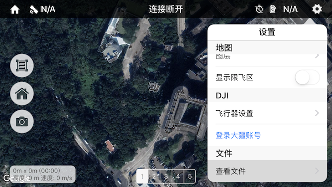
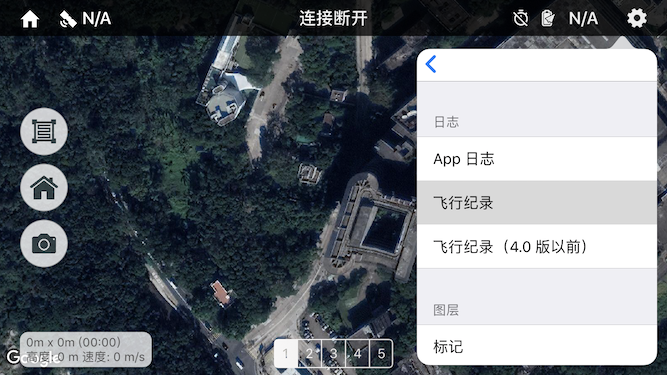
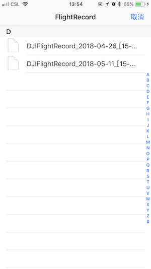
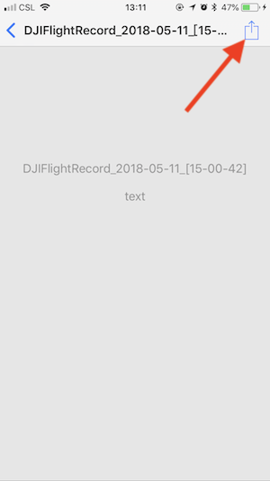
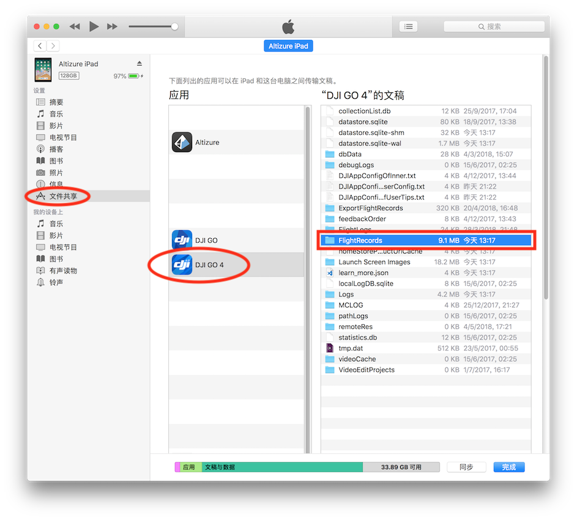
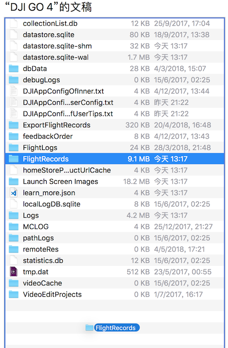
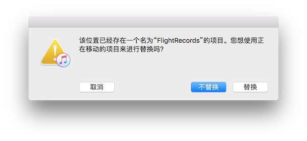
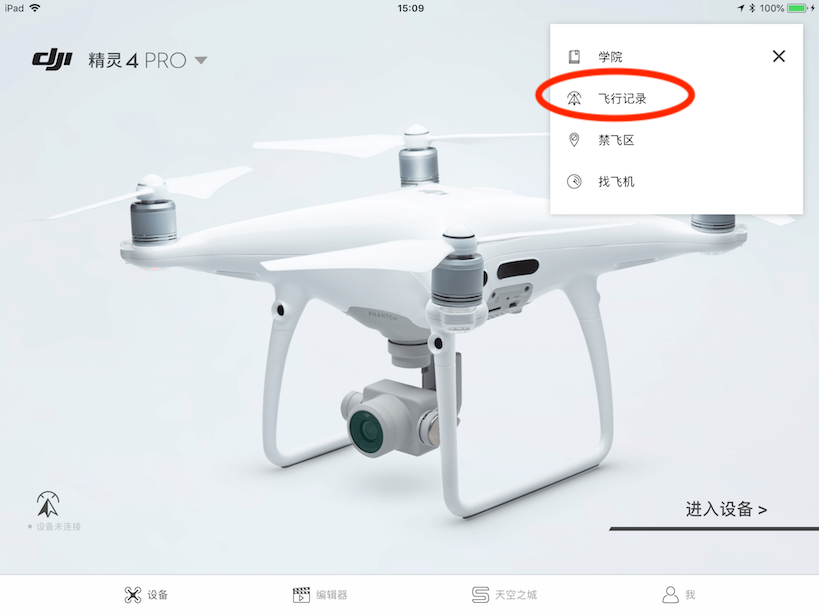

# 飞行记录

## Altizure 有没有飞行记录？

Altizure app 有保存和导出飞行记录的功能。记录的数据可以用于调查飞行事故，找回丢失飞机。（iOS 版本）文件格式与 DJI Go 格式相同，可以兼容 DJI Go 和大部分第三方提供的飞行记录读取工具。

## 如何从 Android app 中导出？

在 Android 设备里，飞行数据文件被储存在文件夹 **/DJI/SDK\_logs **中，你可以用任何文件管理工具将其导出。

## 如何从 iOS app 中导出？

在 iOS 系统中，飞行记录文件被储存在 app 专用的文件夹里，以下为导出方法：

1. 找到 app 内的飞行记录文件管理入口，右上角齿轮图标（设置）-> 文件|查看文件 -> 飞行记录。

     

2. 可以看到有很多 txt 格式的记录文件，以飞行时的日期命名。

    

3. 打开文件（由于文件不是常规的文本所以无法预览），然后点击右上角的分享图标，选择手机/平板上可以用于管理或传输文件的 app 导出。

    

## 查看飞行记录（iOS 版）

将飞行记录导出后可以发现，如果用普通的文本工具打开文件，显示的都是乱码。我们需要借助 DJI Go 或其他记录读取工具来解码并查看。

### 通过电脑端 iTunes 导入 DJI Go 或 DJI Go 4

iOS 版本里导出的飞行记录文件格式与 DJI Go 格式相同，因此可以在 DJI Go 里读取。但由于我们尚未找到直接在手机/平板上导入 DJI Go 的方法，我们需要先使用电脑端的 iTunes 直接将文件放入 DJI Go app 里。

（如果您知道如何直接在手机/平板上将飞行记录文件导入 DJI Go，请联系 Altizure，我们会提供一定的奖励）

1. 在 Windows 上 [下载并安装 iTunes](https://www.apple.com/cn/itunes) \(macOS 自带，不必安装\)，启动后，将 iPhone 或 iPad 与电脑连接。

2. 在 iTunes 左上方点击设备按钮。
    

3. 点击左侧面板的“文件共享”一栏，选中 DJI Go 或 DJI Go 4，可以看到右侧显示 app 内的文件，其中 FlightRecords 文件夹用于储存飞行记录。
    

4. iTunes 不支持直接添加文件到文件夹，因此我们需要以下较为繁琐的步骤

    1. 先将文件夹导出：鼠标点击 FlightRecords 文件夹，将其拖拽到电脑某个文件夹，例如桌面
    2. 将 Altizure app 里导出的飞行记录复制到导出的 FlightRecords 文件夹里
    3. 反过来，将电脑上的 FlightRecords 文件夹拖拽到 iTunes 里
        
    4. iTunes 内弹出窗口询问是否替换，选择 "替换"
        

5. 打开 DJI Go，在首页找到“飞行记录”的入口，进入后可以看到新导入的飞行记录
    

---

该文档最后修改于 {{ file.mtime }}
