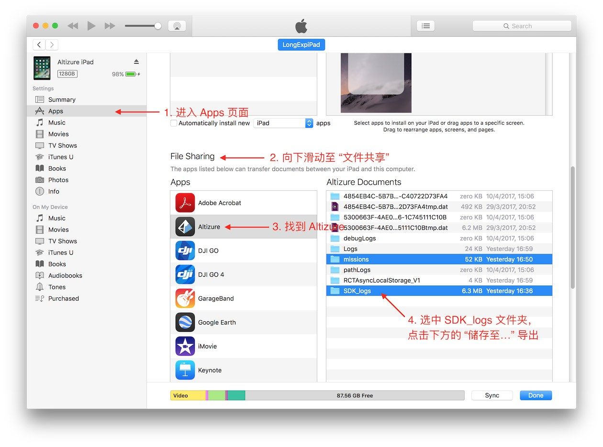

# 飞行安全

## 电量低时飞机会自动返航吗？

如果 Altizure app 里飞机连接状态正常，那么电量低于 30% 时屏幕上会发出警告，并询问你是否需要返航。这时你可以做出选择。如果你选择忽略，那么飞机会照常飞行，直到电量低于 20% 时，app 会自动向飞机发送返航命令，即 ”强制返航“。

上述的前提条件是飞机必须能获得遥控信号。在无遥控信号的状态下，飞机的自主操作取决于固件的 “失控行为”，请参考下一条说明。

## 丢失遥控信号后飞机会继续执行任务还是返航？

默认情况下，我们将 “信号丢失后” 后的飞机行为设置为 “终止任务”，当飞机丢失遥控信号几秒后，固件能自动终止任务，然后飞机按固件里的 “失控行为” 自动操作（默认为返航，可在 DJI Go 中查看，不建议修改）。返航到近处时飞机会获得遥控信号，就可以短按遥控上的返航按钮来取消返航，返航等相关操作请参考大疆的说明书。

Altizure app 里也有提供选项，可以改为 “信号丢失后继续执行任务”。这是危险的设置，我们只希望经验丰富的使用者使用。这种情况下失控行为需要分类讨论：

* 如果飞机电量足够，飞机会继续执行任务并自动拍摄，直到航线终点。如果任务完成后依然没有信号，飞机会触发固件的 “失控行为”（同上）。
* 如果飞行中途电量低于 “低电量警告” （可在 DJI Go 中查看并调整，出厂设置一般是 30%），飞机不会退出任务并返航！！！这是因为目前为止，大疆没有在固件里提供 “低电量终止航线任务” 的功能， 而我们 app 内置的低电量返航只在有信号连接的条件下才能告知飞机返航。
* 如果飞机中途电量低于 “严重低电量警告” （可在 DJI Go 中查看并调整，出厂设置一般是 10% - 15%），飞机可能会受固件要求，在中途强制降落！！！目前大疆还没有提供更改方法。

失控后继续执行任务是实用但危险的操作，只有使用者在充分了解相关操作后才能采用。使用此设置设计航线时，请勿让飞机长时间处于失控状态，应当确保在航线折返回来后飞机能恢复信号连接，以便根据电量状态保护飞机安全。

## 如何从手机/平板设备中导出飞行纪录？

DJI Mobile SDK 在 app 使用时会将飞行数据纪录在设备里，这些数据可以用于调查飞行事故，找回丢失飞机。

### 从 Android app 中导出

在 Android 设备里，飞行数据文件被储存在文件夹 **/DJI/SDK\_logs **中，你可以用任何文件管理工具将其导出。

### 从 iOS app 中导出

在 iOS 系统中，数据文件被储存在 app 专用的数据目录里，以下是导出方法：

1. 在 Windows 上 [下载并安装 iTunes](https://www.apple.com/cn/itunes) \(macOS 自带，不必安装\)，启动后，将 iPhone 或 iPad 与电脑连接。
2. 在 iTunes 左上方点击设备按钮
    
3. 进入 "Apps" 页面，滑动至 "文件共享" 部分，选中 "Altizure" 一栏
    
4. 点击选择 "SDK\_logs"，滑至页面底部，找到并点击 "储存至..." 按钮（或直接拖拽文件夹到桌面
    

---

该文档最后修改于 {{ file.mtime }}
