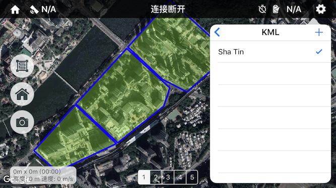
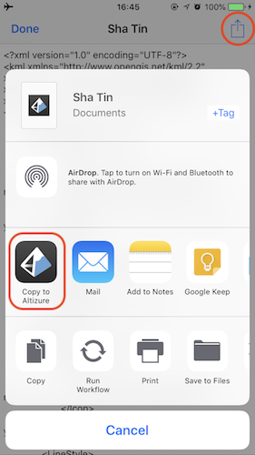
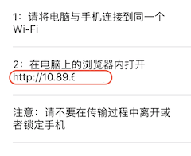
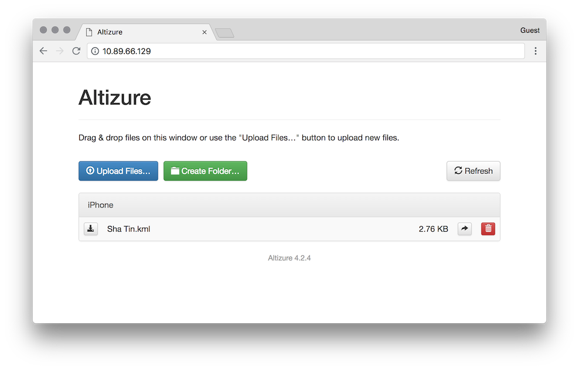
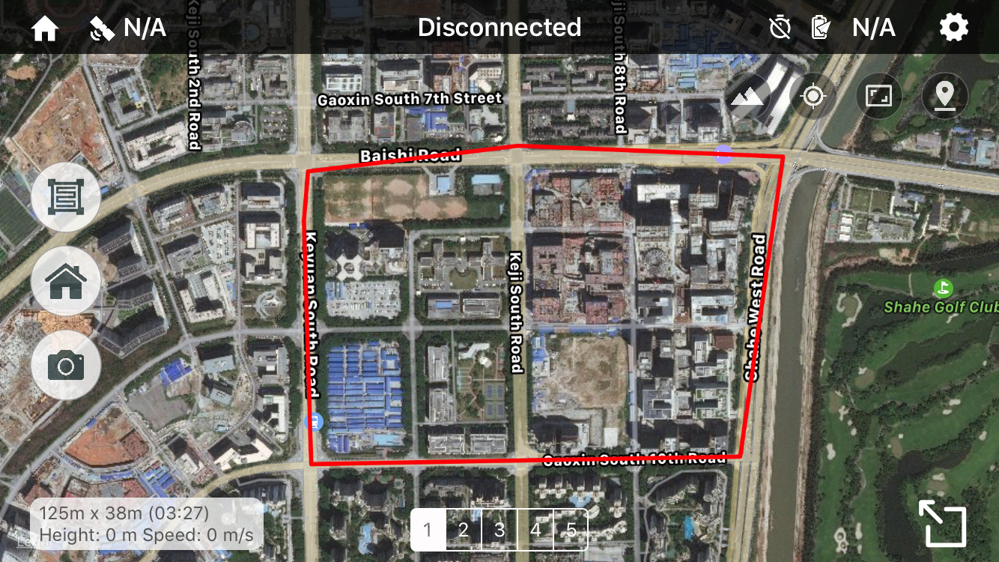
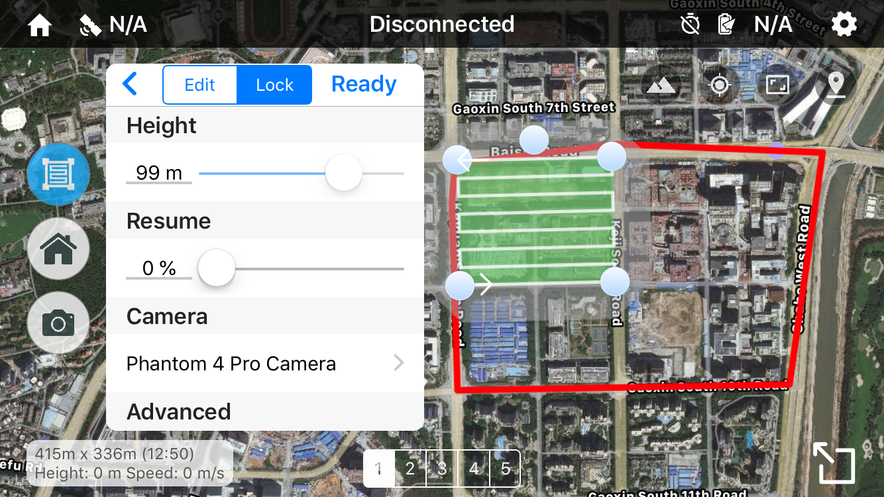
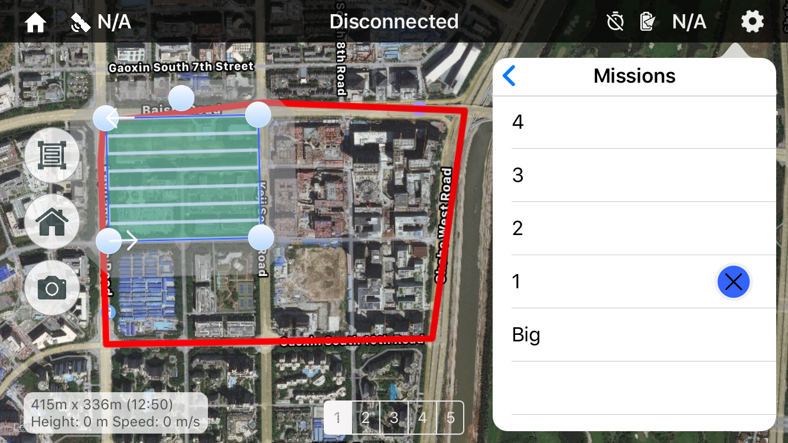
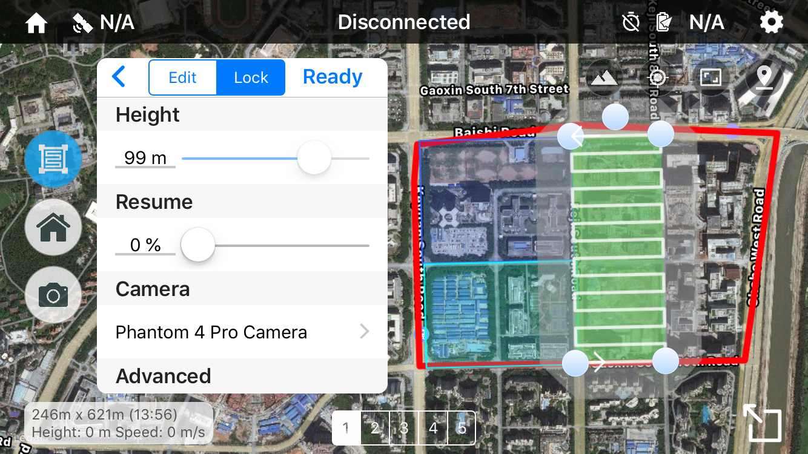
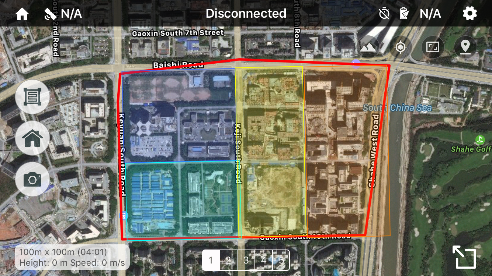

# 地图图层增强 (仅限 iOS)

## 使用 KML 图层{#kml}

KML 是一种常用的用于标记和共享地理数据的格式。Altizure app iOS 版支持在内置地图上添加 KML 图层，帮助设置航线区域。

注：

* 暂时只支持 .kml 格式，不支持 .kmz
* 暂时不支持通过 KML 生成航线

### 显示方法{#show-kml}

点击右上角齿轮图标进入设置面板，进入“图层”，“KML”，勾选需要显示的 KML。

### 导入 KML{#import-kml}

#### 方法一，从其他 app 导入 KML 文件：

这种方法借助其他具有文件管理或传输功能的 app （例如网盘、微信、QQ 等），将 KML 文件导入到 Altizure app 内。可以不借助其他设备，完全在手机/平板内完成。

步骤比较简单：在其他储存有 KML 文件的 app 里找到 KML，选择（或者打开文件），然后使用分享功能。系统弹出分享界面后，点击“拷贝到 Altizure”。

例如 iOS 系统自带的“文件” app：

#### 方法二，通过电脑浏览器上传 KML 文件到 app：

通过这种方法可以直接不经过其他 app，直接从电脑传输 KML 到 Altizure app 里。此方法要求电脑和手机/平板在同一局域网内。步骤：

1. 点击 app 右上角齿轮图标进入设置面板，进入“图层”，“KML”，点击 + 图标，选择 “Wi-Fi 上传”。

2. 按照 app 内指示，在电脑上的浏览器里打开一个局域网内的网址（与手机/平板的 IP 地址相同）。

    

3. 点击网页里的 "Upload Files" 上传本地文件。

    

## 分割大范围任务{#partition-large-mission}

DJI 对任务参数有诸多限制，范围较大的任务可能无法上传给飞行器。因此，您需要将一个大范围任务分割成多个小范围任务分别执行。Altizure app iOS 版提供了一个工具帮助您分割大任务。

假设您的大范围任务如下图红框所示，请按照以下步骤进行分割。

### 1. 在大任务的框架内绘制小任务

首先，请按照正常操作新建一个小范围任务。每次编辑完成后，请点击“保存”以保存修改。

### 2. 将绘制过的小任务显示在地图上

您需要新建多个小范围任务来完成分割。为了使这些小任务衔接准确，您可以将绘制过的小任务显示在地图上，这样能让您依照它们的边界绘制新的任务。

请点击右上角齿轮图标进入设置面板，进入“图层”，“其他任务”，并选择您希望查看的任务。您可以为它们设置不同的颜色方便区分。

### 3. 重复第1、2步，直到大任务被完全分割

请依照绘制过的任务的边界，规划、绘制新的小范围任务。每次编辑完成后，请点击“保存”以保存修改。

在多次新建、显示任务之后，您的大范围任务就被分割成多个小范围任务了。

### 4. 完成

在分割完成后，为了地图的简洁，您可以在“其他任务”界面点击 “X” 隐藏不需要的图层。

现在，您就可以分别执行这些小范围任务，从而完成整个大范围任务了。

